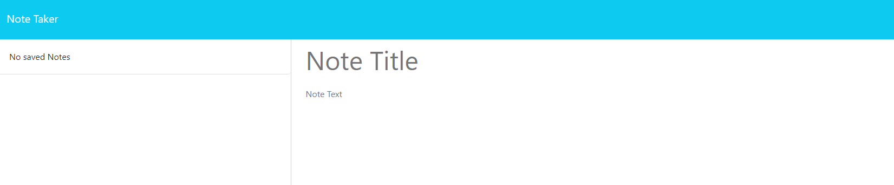

# Note Taker

## Description

This is a web application for simple note taking with an Express.js backend demonstrating potential for data persistence.

- Developing this application furthered my knowledge of API and HTML routes for interacting with a server.
- It allowed me to put some very basic modular routing into practice and explore the use of an additional community NPM package for universally unique identifiers.
- The biggest takeaway for me was building the project directory and realizing the function of public static assets.  
- I made some UI improvements by altering the static assets JavaScript and CSS stylesheet, specifically the event listening for clicking an active note and a hovering property for the delete icon.

## Table of Contents

- [Deployment](#deployment)
- [Usage](#usage)
- [Credits](#credits)
- [License](#license)
- [Questions](#questions)

## Deployment

Here is the [Deployed Application](https://note-taker-ouaj.onrender.com/) hosted by [Render](https://render.com/) cloud infrastructure.

*NOTE: The free tier of Render's web services does not include persistent disks.  See below for how this impacts this application.*

Render Documentation

[Spinning Down on Idle](https://docs.render.com/free#spinning-down-on-idle) - "Your free instance will spin down with inactivity, which can delay requests by 50 seconds or more."

"Render spins down a Free web service that goes 15 minutes without receiving inbound traffic. Render spins the service back up whenever it next receives a request to process."

"Spinning up a service takes a few seconds, which causes a noticeable delay for incoming requests until the service is back up and running. For example, a browser page load will hang momentarily."

[Render Persistent Disk Documentation](https://docs.render.com/disks) - "By default, Render services have an ephemeral filesystem. Without a persistent disk, any changes you make to a service’s local files are lost every time the service redeploys or restarts."

WHAT THIS MEANS: The application will likely take a minute to load when you first navigate to it.  Request times will be faster after that.  In addition, this web application does not truly have persistent data.  After 15 minutes of inactivity the application will restore back to the original GitHub repository files, including the db.json file in the repo.

## Usage

Here is the [Code Repository](https://github.com/briandwach/note-taker) and a video demonstration of the application can be viewed [HERE](https://drive.google.com/file/d/1TwEOFbj3kDWBNLmAVJVB_xU8CBAdNnbm/view?usp=sharing).

- Click "Get Started" to navigate to the notes page.

  

- To create a note, begin typing where the placeholder text says "Note Title".

  

- When you've included a Note Title and Note Text, click the "Save Note" button at the top right to save your note and have it included on the list to the left.

  

- Clicking on a saved note to the left will load the note information on the right.  Click "New Note" at the top right to begin creating a new note.  The red trash can icons can be clicked to delete a specific note.

  

## Credits
This application utilizies the [uuid](https://www.npmjs.com/package/uuid) NPM package developed by [Robert Kieffer](https://github.com/broofa) and [Christoph Tavan](https://github.com/ctavan).

The clog.js middleware and fsUtils.js helper file were sourced from Northwestern Coding Bootcamp's [NU-VIRT-FSF-PT-12-2023-U-LOLC GitLab Repository](https://git.bootcampcontent.com/Northwestern-University/NU-VIRT-FSF-PT-12-2023-U-LOLC) from the Express.js course materials.

## License
This application is covered under the [MIT License](http://choosealicense.com/licenses/mit/).

## Questions
Please email me with any questions regarding this application at: brian.d.wach@gmail.com

Additionally, checkout more of my work on GitHub: [briandwach](https://github.com/briandwach)